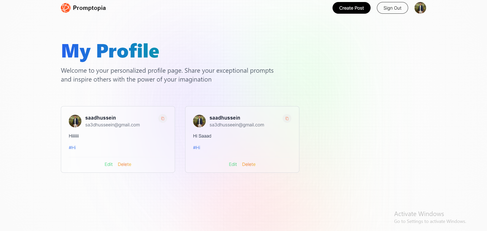

# Promptopia
Promptopia is a Full Stack CRUD System.

I used in this project Next.js, MongoDB and Mongoose.

In this website you can show Prompts of other people and after you login in with google you can also create, edit and delete prompts and other people can see your prompts.

I added Authentication with google using NextAuth Library, For backend I used Next.js and the advantage of API Routes in Next.js and for database I used MongoDB and Mongoose for working with database in backend.

You can show website in this [Link](https://promptopia-dusky-nu.vercel.app/)
